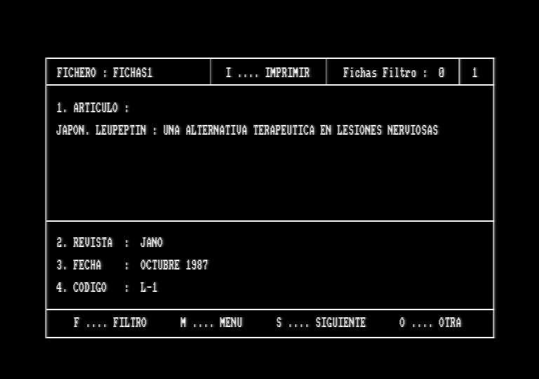
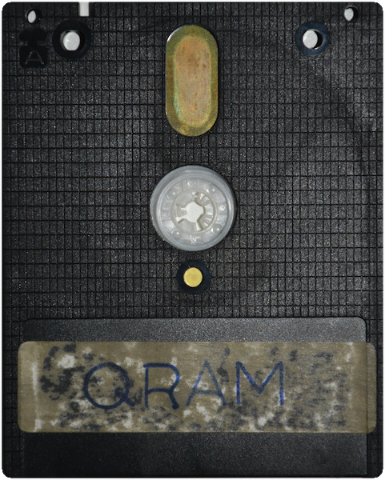
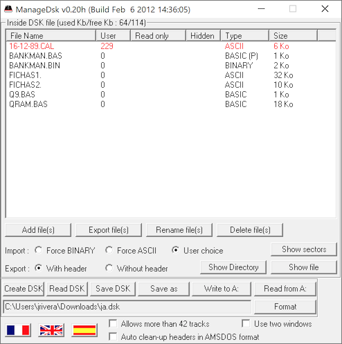

# QRAM 1989

Durante 1989 se indexaron cientos de referencias de artículos médicos publicados en revistas de la época como _JANO, MEDICINA CLÍNICA, CIENCIA MÉDICA, MEDICINA INTEGRAL, TIEMPOS MÉDICOS,_ etc.

Para tal fin, se desarrolló un programa de gestión **"QRAM"**, en [Locomotive Basic](https://es.wikipedia.org/wiki/Locomotive_BASIC), en un ordenador personal [Amstrad CPC6128](https://es.wikipedia.org/wiki/Amstrad_CPC), muy popular a finales de los ochenta.

Siendo necesario explotar los 128 Kbytes de memoria del CPC6128, se recurrió al gestor de bancos de memoria proporcionado por Amstrad [BANKMAN](https://github.com/sevioptero/Amstrad-CPC6128-Manual-del-Usuario/wiki/1.11.-Introducci%C3%B3n-al-gestor-de-bancos-de-memoria).

Haz click aquí [**Amstrad CPC6128 QRAM DSK**](https://latchdevel.github.io/qram1989/index.html?file=disk/qram.dsk&input=cat%0Arun%22Q9%0A) para rememorar su uso.

## Emulador Amstrad CPC6182
El emulador forma parte del conjunto de herramientas de emulación de sistemas de 8-bits publicadas en el repositorio [github.com/floooh/chips](https://github.com/floooh/chips), el cual, compilado como un objeto ["WebAssembly"](https://es.wikipedia.org/wiki/WebAssembly) puede ejecutarse en cualquier navegador web con soporte JavaScript/HTML5, requiriendo únicamente tres archivos estáticos:
* **index.html**
* **cpc.js**
* **cpc.wasm**

Licencia [**"zlib/libpng"**](https://opensource.org/licenses/Zlib) Copyright (c) 2018 Andre Weissflog

## Disco 3" CF-2 (qram.dsk)
El soporte para el almacenamiento del programa de gestión y los archivos de datos fue un [disco de 3" CF-2](https://www.cpcwiki.eu/index.php/CF2_Compact_Floppy_Disc), ya que el CPC6128 integra internamente tanto la controladora ["FDC µPD765"](https://www.cpcwiki.eu/index.php/765_FDC) como su correspondiente disquetera fabricada por Hitachi.

El sistema operativo de disco del Amstrad CPC [AMSDOS](https://es.wikipedia.org/wiki/AMSDOS) soporta tres formatos estandar para los discos:
* **CPC-DATA**: 40 pistas, con 9 sectores por pista de 512 bytes, 180 Kbytes en cada cara del disco, de los cuales son utilizables 178 Kb.
* **CPC-SYSTEM**: 40 pistas, con 9 sectores por pista de 512 bytes, 180 Kbytes en cada cara del disco, pero 2 pistas se reservan para el [CP/M](https://es.wikipedia.org/wiki/CP/M), por lo que solo son utilizables 169 Kb.
* **CPC-IBM**: 40 pistas, con 8 sectores por pista de 512 bytes, 160 Kbytes en cada cara del disco, son utilizables 158 Kb con compatibilidad con [CP/M-86](https://es.wikipedia.org/wiki/CP/M-86).

Para la lectura del disco original se emplea la misma disquetera modelo [EME-155](https://www.cpcwiki.eu/index.php/Amstrad_FDD_part) utilizada en 1989, junto con una controladora [USB GreaseWeazle V4](https://github.com/keirf/greaseweazle/wiki/Greaseweazle-Models).

El script en Python que maneja la GreaseWeazle lee la información del disco sin procesar, almacenándola en formato ["SuperCard Pro"](https://www.cbmstuff.com/downloads/scp/scp_image_specs.txt) como un **"raw flux stream"**.

`$ gw read --revs 5 --rpm 300 --drive B --tracks="c=0-39:h=0" qram.scp`

La generación de una imagen de disco [**DSK**](https://www.cpcwiki.eu/index.php/Format:DSK_disk_image_file_format) a partir del **SPC** se realiza mediante una adaptación del software ["HxC Floppy Emulator Project"](https://github.com/latchdevel/HxCFloppyImageConverter).

`$ hxcfe -finput:qram.scp -conv:AMSTRADCPC_DSK -foutput:qram.dsk`

Existiendo varias herramientas capaces de extraer archivos de una imagen DSK, solo [ManageDSK](https://www.cpcwiki.eu/index.php/ManageDsk) puede extraer los archivos Basic ".BAS" en formato "listado".

## Snapshot (qram.sna) 
Dado que el proceso de carga resulta tedioso, para facilitar una fácil y rápida puesta en marcha, se ha generado una instantánea ".SNA" del sistema mediante el emulador [WinAPE v2.0 beta2](http://www.winape.net/) del tipo "Version 3, First 128K (uncompressed)" con el programa de gestión cargado en memoria junto con un archivo de fichas y aplicado un filtro genérico, posibilitando acceder al sistema con todo su contenido de forma inmediata.

Haz click aquí [**Amstrad CPC6128 QRAM SNA**](https://latchdevel.github.io/qram1989/index.html?file=qram.sna) para acceder.
